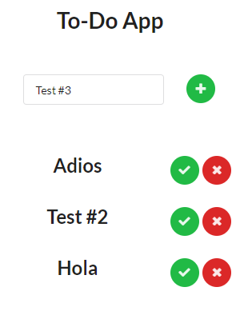

# TO-DO-LIST_MongoDB-frontend-REMOTO

 
  

https://to-do-mongodb-frontend.herokuapp.com/

# Puedes Crear

 
  

# Puedes Marcar Como Realizado

 
  

# Puedes Borrar

 
  

# Puedes Editar

 
  

# Conexion a Base de Datos en Backend

- https://github.com/JymmyMurillo/TO-DO-LIST_MongoDB-backend-

 
  

